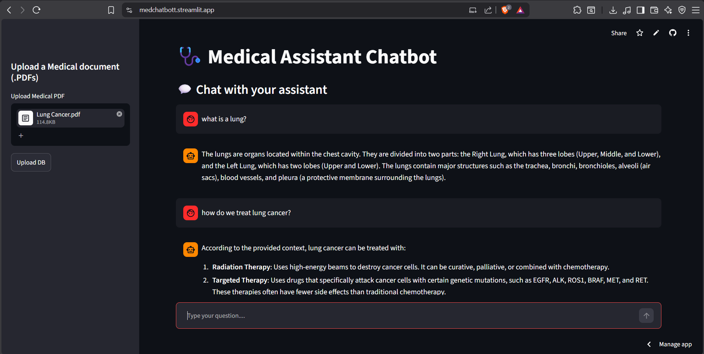
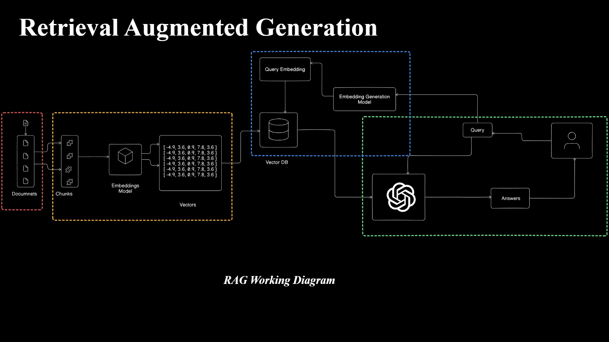
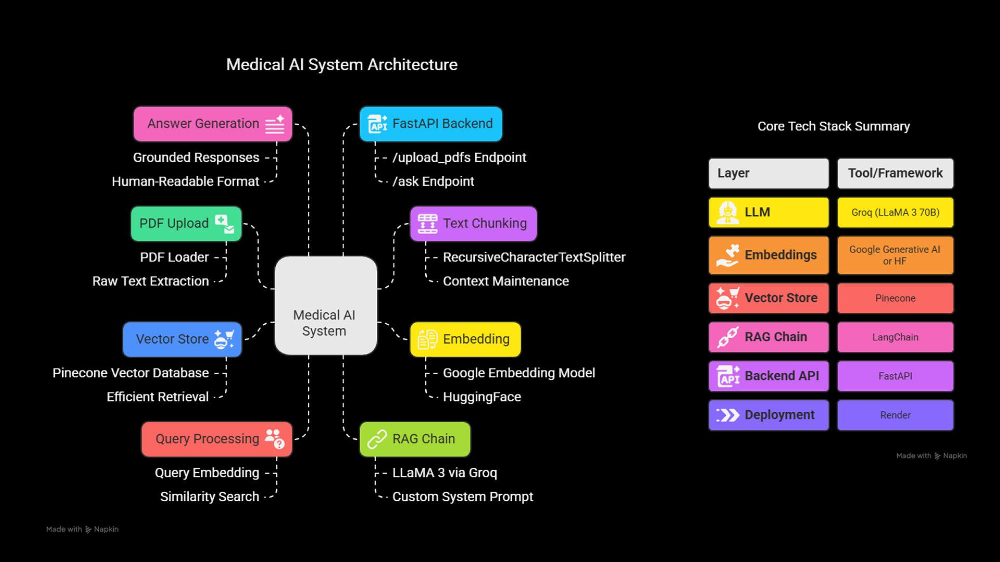

# 📅 AI Medical Assistant Chatbot — RAG-based Application
---

## 🧠 Project Overview

This application is a **Medical Domain Chatbot** built using **Retrieval-Augmented Generation (RAG)**. It allows users to upload their own medical documents (e.g., textbooks, reports), and the system intelligently answers queries by retrieving the most relevant content before generating a final response.

---

<p align="center">
  
</p>

---


## 🎓 What is RAG?

**RAG (Retrieval-Augmented Generation)** enhances language models by supplying relevant external context from a knowledge base, preventing hallucinations and improving accuracy, especially for factual or specialized domains like **medicine**.

---

## 🔄 Architecture

```
User Input
   ↓
Query Embedding → Pinecone Vector DB ← Embedded Chunks ← Chunking ← PDF Loader
   ↓
Retrieved Docs
   ↓
RAG Chain (Groq + LangChain)
   ↓
LLM-generated Answer
```
---

<p align="center">
  
</p>

---

## 📚 Features

- Upload medical PDFs (notes, books, etc.)
- Auto-extracts text and splits into semantic chunks
- Embeds using Google/BGE embeddings
- Stores vectors in **Pinecone DB**
- Uses **Groq's LLaMA3-70B** via LangChain
- FastAPI backend with endpoints for file upload and Q\&A

---

## 🌐 Tech Stack

| Component  | Tech Used                  |
| ---------- | -------------------------- |
| LLM        | Groq API (LLaMA3-70B)      |
| Embeddings | Google Generative AI / BGE |
| Vector DB  | Pinecone                   |
| Framework  | LangChain                  |
| Backend    | FastAPI                    |
| Deployment | Render                     |

---

<p align="center">
  
</p>

---


## 📚 API Endpoints

```http
POST /upload_pdfs/ --- Upload one or more PDF files

POST /ask/ --- Ask a question --- Form field: `question`

```

---

## 📁 Folder Structure

```
└── 📁assets
    ├── UI.png
    ├── rag_diagram.png
    └── tech_stack.png
```

```
└── 📁client
    └── 📁components
        ├── ChatUI.py
        ├── download_history.py
        ├── upload.py
    └── 📁utils
        ├── api.py
    ├── app.py
    ├── config.py
    └── requirements.txt
```

```
└── 📁server
    └── 📁middlewares
        ├── exception_handlers.py
    └── 📁modules
        ├── llm.py
        ├── load_vectorstore.py
        ├── file_handler.py
        ├── query_handler.py
    └── 📁routes
        ├── ask_questions.py
        ├── upload_pdf.py
    └── 📁uploaded_docs
    ├── .env
    ├── logger.py
    ├── main.py
    └── requirements.txt
```

```
└── .gitignore
├── LICENSE
├── README.md
└── main.py

```

---

## ⚡ Quick Setup

```bash
# Clone the repo
$ git clone https://github.com/Pratikpatil-25/RAG-based-Medical-Assistant-Chatbot.git

# Create virtual env
$ uv venv
$ .venv/bin/activate  # Windows: venv\Scripts\activate

$ cd "RAG based Medical Assistant"/server

# Install dependencies
$ uv pip install -r requirements.txt

# Set environment variables (.env)
GOOGLE_API_KEY=...
GROQ_API_KEY=...
PINECONE_API_KEY=...

# Run the server
$ uvicorn main:app --reload --port 8000


$ cd "RAG based Medical Assistant"/client

# Install dependencies
$ uv pip install -r requirements.txt

# Run the server
$ streamlit run app.py
```

---

## 🌐 Deployment

- Hosted on [Render](https://render.com)
- Configure `start command` as:

  ```bash
  uvicorn main:app --host 0.0.0.0 --port 10000
  ```

---

## 🌟 Credits

- Built by Pratik Patil
- Inspired by LangChain, Groq, Pinecone, and FastAPI ecosystems

---

## 🎉 License

This project is licensed under the MIT License.
